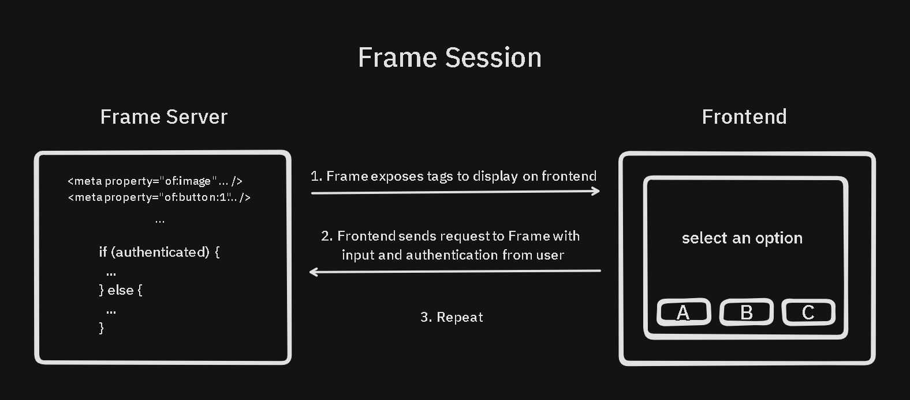

# Lens Protocol Frames

- [Overview](#overview)
- [FAQ](#FAQ)
- [Lens Frame Specification](#specification)
  - [Tags](#tags)
  - [Images](#images)
  - [Button Actions](#button-actions)
  - [Frame Requests](#frame-requests)
  - [Authentication](#authentication)
- [Build Lens Frames](#build-lens-frames)
- [Integrate Lens Frames](#integrate-lens-frames)
- [Publications as Frames / Lens Protocol Actions](#publications-as-frames--lens-protocol-actions)
- [Changelog](#changelog)
- [Future Developments](#future-developments)

# Overview

Frames are an extension of the [OpenGraph protocol](https://ogp.me/) that enable interactive elements to be embedded between web applications.

A frame is a session between a frontend and frame server. The frame server exposes visual elements and actions that are able to be interacted through a frontend that embeds the frame. Frames can represent a wide variety of applications including informational guides, games, Web3 transactions, image galleries, e-commerce, live data, and much more.

<p align="center">
  
</p>

A frame session is also able to incorporate authentication protocols, allowing the frame server to verify the inputs and identity of an interaction. [Open Frames](https://github.com/open-frames/standard/tree/main) is a set of standard frame tags that enables elements of frames to be shared between protocols.

Lens Frames are an extension of the Open Frames standard that enables Lens social context (profile, publications) to be referenced and authenticated.

The highlights of the Lens Frames specification are:

- Frame request types and authentication based on Lens primitives
- Implement tags and request types from Open Frames standard
- Lens API and Lens SDK methods to perform signing and verification of requests
- Publication metadata field to enable Lens publications as frames
- Interactions with open action modules
- Describe how open actions can be executed through transaction frames, and enhance the verifiability for apps

# FAQ

## What is a Lens Frame?

Lens Frames are an extension of the Open Frames standard that enables Lens social context (profile, publications) to be referenced and authenticated within a Frame session.

A Lens Frame is an application that returns HTML `<meta>` tags specifying the app requirements, buttons, text input, and actions of the Frame, and can update state based on button interactions.

## What tags are required for a Lens Frame?

Lens Frames are expected to have the following tags in order to be rendered by Open Frame applications:

- 1. `of:version`
- 2. `of:image` is defined
- 3. `of:accepts:lens` OR `of:accepts:anonymous`
  - Value for (3) is set based on whether Lens authentication is required by the Frame or not

## How do I build a new Lens Frame?

Developers can checkout the [frames.js Quickstart Guide](https://framesjs.org/guides/create-frame), then add Lens as an [accepted clientProtocol](https://github.com/defispartan/demo-multi-frame/blob/main/app/frames/frames.ts).

Or check out demo Frames:

- https://github.com/defispartan/demo-multi-frame - Authenticated frame compatible with FC, XMTP, and Lens (frames.js)
- https://github.com/defispartan/gm-open-frame/ - Demo of text input and unauthenticated Frame (onchainkit)
- https://github.com/defispartan/tx-boilerplate-frame - Toggling between networks to send 0 value transaction (onchainkit)

## How do I convert an existing frame to be compatible with Lens applications?

Frames can be modified to be compatible with Lens applications with the following steps:

- frames.js: Add Lens as [clientProtcol within createFrames](https://github.com/defispartan/demo-multi-frame/blob/main/app/frames/frames.ts)
- onchainkit: Add [Lens Frame required tags](#what-is-a-lens-frame) to [Metadata](https://github.com/defispartan/gm-open-frame/blob/main/src/app/page.tsx)
- Frog: [XMTP Middleware](https://frog.fm/concepts/middleware#xmtp-frames-middleware) can be used a template
- Other: Add `<meta>` tags to `<head>` of HTML page matching [Lens requirements](#what-tags-are-required-for-a-lens-frame)

## Where are Lens Frames suported?

| Interface                            | Open Frames | Lens Frames | Transaction Frames |
| ------------------------------------ | ----------- | ----------- | ------------------ |
| https://buttrfly.app                 | X           | X           |                    |
| https://converse.xyz                 | X           |             |                    |
| https://framesjs-debugger.vercel.app | X           | X           | X                  |

## What is unique about Lens Frames?

Lens profile owners and managers are Ethereum addresses. The Ethereum signer of a Lens session can be used to interact with transaction Frames, providing a link between the social and onchain interactions and unlocking new opportunities to modify an onchain action based on the social context.

Lens Publications can contain open actions, smart contract contract addresses and calldata that define an instance of any onchain action. By specifying an open action module (such as paid collect, swap, or NFT minting), an app can render a Frame from a preset URL based on the action or from [publication metadata](#publications-as-frames--lens-protocol-actions). By creating frames from open actions, apps can filter and curate transaction Frames based on contract addresses rather than URLs, and verify that transactions mathes the intent of the original poster.

# Specification

A frame is a set of `<meta>` tags returned within the `<head>` of an HTML page.

If a page contains all required frame properties, apps will render the page as a frame. The frame `<meta>` tags extend the OpenGraph protocol.

A frame app begins with an initial frame which is cached by apps and shown to users. A frame must have an image. It may have buttons, which when clicked load other frames or redirect the user to external websites.

## Tags

A frame property is a meta tag with a property and a content value.

### Required Properties

In compliance with the Open Frames standard, a Frame built to be rendered on Lens applications must contain the following tags:

| Property                                    | Description                                                                                              |
| ------------------------------------------- | -------------------------------------------------------------------------------------------------------- |
| `of:version`                                | The version label of the Open Frames spec. Currently the only supported version is `vNext`               |
| `of:image`                                  | An image which should have an aspect ratio of `1.91:1` or `1:1`.                                         |
| `og:image`                                  | An image which should have an aspect ratio of `1.91:1`. Fallback for clients that do not support frames. |
| `of:accepts:lens` OR `of:accepts:anonymous` | Specifies whether Frame requires Lens authentication or does not require authentication.                 |

### Optional properties

| Property                  | Description                                                                                                                                                                                                                                                                            |
| ------------------------- | -------------------------------------------------------------------------------------------------------------------------------------------------------------------------------------------------------------------------------------------------------------------------------------- |
| `of:accepts:lens`         | The minimum spec version for authenticated requests using Lens Frames standard. Currently the only supported version is `1.0.0`. Only required if `of:accepts:anonymous` is not specified                                                                                              |
| `of:accepts:anonymous`    | If present, specifies that frame server does not require an authenticated response, tag content not required but can be set to `true`                                                                                                                                                  |
| `of:context:lens`         | Boolean value specifying whether requests sent to frame server must include context (untrustedData) corresponding to the client protocol. Default = `true`                                                                                                                             |
| `of:button:$idx`          | 256 byte string containing the user-visible label for button at index `$idx`. Buttons are 1-indexed. Maximum 4 buttons per Frame. `$idx` values must be rendered in an unbroken sequence.                                                                                              |
| `of:button:$idx:action`   | Valid options are `post`, `post_redirect`, `mint`, `link`, and `tx`. Default: `post`                                                                                                                                                                                                   |
| `of:button:$idx:target`   | The target of the action. For `post` , `post_redirect`, and link action types the target is expected to be a URL starting with `http://` or `https://`. For the mint action type the target must be a [CAIP-10 URL](https://github.com/ChainAgnostic/CAIPs/blob/main/CAIPs/caip-10.md) |
| `of:button:$idx:post_url` | 256-byte string that defines a button-specific URL to send the POST payload to. If set, this overrides `of:post_url`                                                                                                                                                                   |
| `of:post_url`             | The URL where the POST payload will be sent. Must be valid and start with `http://` or `https://` . Maximum 256 bytes.                                                                                                                                                                 |
| `of:input:text`           | If this property is present, a text field should be added to the Frame. The contents of this field will be shown to the user as a label on the text field. Maximum 32 bytes.                                                                                                           |
| `of:image:aspect_ratio`   | The aspect ratio of the image specified in the `of:image` field. Allowed values are `1.91:1` and `1:1`. Default: `1.91:1`                                                                                                                                                              |
| `of:image:alt`            | Alt text associated with the image for accessibility                                                                                                                                                                                                                                   |
| `of:state`                | A state serialized to a string (for example via JSON.stringify()). Maximum 4096 bytes. Will be ignored if included on the initial frame                                                                                                                                                |

## Images

There are a few rules for serving images in `of:image` tags:

- The size of the image must be < 10 MB.
- The type of image must be jpg, png or gif.
- The image source must either be an external resource with content headers or a data URI.

Clients may resize larger images or crop those that do not fit in their aspect ratio. SVG images are not because they can contain scripts and extra work must be done by clients to sanitize them.

When a frame server receives a POST request:

- It must respond within 5 seconds.
- It must respond with a 200 OK and another frame, on a post button click.
- It must respond with a 302 OK and a Location header, on a post_redirect button click.
- Any Location header provided must contain a URL that starts with http:// or https://.

Frame servers can use cache headers to refresh images and offer more dynamic first frame experiences:

Frame servers can use the max-age directive in the HTTP Cache-Control header to ensure images in the initial frame refresh automatically. A lower max-age ensures images update regularly without user interactions. App developers should respect cache headers set by the original frame image, and their image proxy implementations should not interfere with durations.

It is recommended to add timestamps or UUIDs to image urls on subsequent frames to bust caches, and return a frame with a "refresh" button if it is expected that a frame response could take > 5 seconds.

## Button actions

### `post`

The `post` action sends a HTTP POST request to the frame or button `post_url`. This is the default button type.

The frame server receives a signed frame action payload in the POST body, which includes information about which button was clicked, text input, and the cast context. The frame server must respond with a `200 OK` and another frame.

## `post_redirect`

The `post_redirect` action sends an HTTP POST request to the frame or button `post_url`. You can use this action to redirect to a URL based on frame state or user input.

The frame server receives a signed frame action payload in the POST body. The frame server must respond with a `302 Found` and `Location` header that starts with `http://` or `https://`.

## `link`

The `link` action redirects the user to an external URL. You can use this action to redirect to a URL without sending a POST request to the frame server.

Clients do not make a request to the frame server for link actions. Instead, they redirect the user to the `target` URL.

## `mint`

The `mint` action allows the user to mint an NFT. Clients that support relaying or initiating onchain transactions may enhance the mint button by relaying a transaction or interacting with the user's wallet. Clients that do not fall back to linking to an external URL.

The target property must be a valid [CAIP-10](https://github.com/ChainAgnostic/CAIPs/blob/main/CAIPs/caip-10.md) address, plus an optional token ID appended with a `:`.

## `tx`

The `tx` action allows a frame to send a transaction request to the user's connected wallet. Unlike other action types, tx actions have multiple steps.

First, the client makes a POST request to the `target` URL to fetch data about the transaction. The frame server receives a signed frame action payload in the POST body, which includes the `profileId` and optional `signer` field that can be verified using the [authentication](#authentication) steps. The frame server must respond with a `200 OK` and a JSON response describing the transaction which satisfies the following type:

```ts
type TransactionTargetResponse {
  chainId: string;
  method: "eth_sendTransaction";
  params: EthSendTransactionParams;
}
```

### Ethereum Params

If the method is `eth_sendTransaction` and the chain is an Ethereum EVM chain, the param must be of type `EthSendTransactionParams`:

- `abi`: JSON ABI which **MUST** include encoded function type and **SHOULD** include potential error types. Can be empty.
- `to`: transaction recipient
- `value`: value to send with the transaction in wei (optional)
- `data`: transaction calldata (optional)

```ts
type EthSendTransactionParams {
  abi: Abi | [];
  to: `0x${string}`;
  value?: string;
  data?: `0x${string}`;
}
```

Example:

```json
{
  "chainId": "eip155:1",                                // The chain ID of the transaction
  "method": "eth_sendTransaction",                      // The method to call on the wallet
  "params": {
    "abi": [...],                                       // JSON ABI of the function selector and any errors
    "to": "0x0000000000000000000000000000000000000001", // The recipient of the transaction
    "data": "0x00",                                     // Transaction calldata
    "value": "123456789",                               // Value to send with the transaction
  },
};
```

The client then sends a transaction request to the user's connected wallet, or uses the calldata to generate a signed or dispatched action for Lens protocol actions following instructions [here](#lens-publications-as-frames--open-actions). The client should then send a POST request to the `post_url` with a signed frame action payload including the transaction hash in the `actioNResponse` field to which the frame server should respond with a `200 OK` and another frame.

## Frame Requests

When a user clicks a button on a frame, the frame receives a POST request with the payload format below. The payload contains `untrustedData`, containing details of the action taken, and `trustedData`, an EIP-712 signed message from a profile owner or delegated executor used to verify the authenticity that a frame request originated from a specific Lens profileId.

```
{
  clientProtocol: "lens",               // string, authentication protocol that frame server will verify
  untrustedData: {
    specVersion: "1.0.0"                // string, Lens frame spec version that frame server is verifying typed data against
    profileId: "0x123",                 // string, Lens profile ID performing the action
    pubId: "0x123-0x1",                 // string, Lens publication ID being interacted with, poster profile ID + publication index
    url: "https://example.com",         // string, the URL of the Frame that was clicked. May be different from the URL that the data was posted to.
    unixTimestamp: 123456789,           // number, Unix timestamp in milliseconds
    buttonIndex: 1,                     // number, the button that was clicked
    inputText?: "Hello, World!",        // string, optional, input text for the Frame's text input, if present. Undefined if no text input field is present
    deadline?: 123456789,               // number, optional, unix timestamp of signature expiration
    state?: "%7B%22counter%22%3A1%7D"   // string, optional, state that was passed from the frame, passed back to the frame, serialized to a string. Max 4kB.q
    actionResponse?: "0x"               // string, optional, transaction hash, if executed through tx button
    identityToken?: "",                 // string, optional, token issued by Lens API to verify profile identity and/or perform verification with Lens API from frame server
    signerType?: "",                    // string, optional, specifies type of signer used to sign typed data from messageBytes: "owner" or "delegatedExecutor"
    signer?: "",                        // string, optional, address used to sign type data from trustedData.messageBytes
  },
  trustedData: {
    messageBytes: "",                   // string, EIP-712 signed message of request payload or blank string if action is not authenticated
  }
}
```

## Authentication

When a frame server receives a [request](#frame-requests), the server is able to verify that the contents of `untrustedData` are authorized by the associated Lens `profileId` using the steps described here.

A Lens Profile is an NFT with one owner address and any number of delegated executors, addresses with the ability to execute actions on a profile's behalf. Lens frame authentication is based on verifying EIP-712 signed typed data from a profile owner or delegated executor.

<details>
<summary>Frame Request EIP-712 Typed Data</summary>

```
// EIP-712 domain
const domain = {
    name: 'Lens Frames',
    version: '1.0.0',
    chainId: 137,
    verifyingContract": '0x0000000000000000000000000000000000000000'
}

// EIP-712 types
const types = {
    FrameData: [
        { name: 'specVersion', type: 'string' },
        { name: 'url', type: 'string' },
        { name: 'buttonIndex', type: 'uint256' },
        { name: 'profileId', type: 'string' },
        { name: 'pubId', type: 'string' },
        { name: 'inputText', type: 'string' },
        { name: 'state', type: 'string' },
        { name: 'actionResponse', type: 'string' },
        { name: 'deadline', type: 'uint256' },
    ],
};

// Data to sign, from frameDispatcherSignature endpoint request
const sampleData = {
    specVersion: '1.0.0',
    url: 'https://mylensframe.xyz',
    buttonIndex: 2,
    profileId: '0x2a6b',
    pubId: '0x2a6b-0x11-DA-bf2507ac',
    inputText: 'Hello, World!',
    state: '{"counter":1,"idempotency_key":"431b8b38-eb4d-455b"}',
    actionResponse: "0x4a2765ce77932feacfb2b06ee63161afe34781d6e00a6997af87cbe21d6b5b91",
    deadline: 123456789,
};
```

Any address that has signless interactions enabled has approved the Lens API as a delegated executor, this is recommended as the default form of authentication to enable frame interactions without manual signatures. The end-to-end process of authenticating a frame request is as follows:

1.) Lens application requests a frame signature from Lens API OR the currently connected address if profile does not have signless actions enabled on Lens API. Methods for constructing and signing typed data are detailed in [integration section](#integrate-lens-frames).

2.) Lens application sends POST [request](#frame-requests) to frame server with `trustedData` fields populated based on (1).

3.) Frame server verifies signature by constructing typed from frame request and validating that message is signed by profile owner or delegated executor. Methods for constructing and verifying typed data are detailed in [building section](#build-lens-frames).

</details>

# Build Lens Frames

A minimum viable frame consists of a web server serving tags from the [Lens specification](#tags). When a frame server receives a request to the `post_url` or `url` (depending on which is specificed), it can: perform authentication, perform background actions, update frame state.

A frame can authenticate the Lens profile id that originated a request, the address that signed the request (profile owner or delegated executor), and that the content of the request matches what the profile signed. It can do so utilizing the `trustedData` fields as described in [authentication](#authentication).

The following sections detail how frame servers can utilize various methods to authenticate a Frame request:

<details>
<summary>Lens Client SDK</summary>

NodeJS script to create and verify typed data from Lens Client SDK based on `untrustedData` and `trustedData` inputs from frame request. Install library with preferred package manager:

```
yarn install @lens-protocol/client@2.0.0
```

```
const { LensClient, production } = require("@lens-protocol/client");

const lensClientConfig = {
  environment: production,
};

const lensClient = new LensClient(lensClientConfig);

lensClient.frames
  .createFrameTypedData({
    ...req.body.untrustedData // Frame server request, untrustedData
  })
  .then((response) => {
    lensClient.frames
      .verifyFrameSignature({
        identityToken: req.body.untrustedData.identityToken, // Frame server request, untrustedData.identityToken
        signature: req.body.trustedData.messageBytes, // Frame server request, trustedData.messageBytes,
        signedTypedData: response,
      })
      .then((verification) => {
        if(verification === FrameVerifySignatureResult.Verified){
          console.log("Frame request verified")
        } else {
          console.log(`Frame request unverified: ${verification}`)
        }
      });
  });
```

</details>

<details>
<summary>Lens API</summary>

Production endpoint: https://api-v2.lens.dev

NodeJS script to create and verify typed data from Lens API based on `untrustedData` and `trustedData` inputs from frame request. No libraries required, example uses built-in `fetch` method.

```
const createTypedDataQuery = `
  query CreateFrameTypedData($request: FrameEIP712Request!) {
    result: createFrameTypedData(request: $request) {
        types {
            FrameData {
              name
              type
            }
        }
        domain {
            name
            chainId
            version
            verifyingContract
        }
        value {
            specVersion
            url
            buttonIndex
            profileId
            pubId
            inputText
            state
            actionResponse
            deadline
        }
    }
  }
`;

const createTypedDataVariables = req.body.untrustedData; // Frame server request, untrustedData

const createTypedDataOptions = {
  method: "POST",
  headers: {
    "Content-Type": "application/json",
  },
  body: JSON.stringify({
    query: createTypedDataQuery,
    variables: createTypedDataVariables,
  }),
};

fetch("https://api-v2.lens.dev", createTypedDataOptions)
  .then((response) => response.json())
  .then((typedData) => {
    console.log(JSON.stringify(typedData.data.result, null, 2));
    const verifyQuery = `
    query VerifyFrameSignature($request: FrameVerifySignature!) {
      result: verifyFrameSignature(request: $request)
    }
  `;

    const verifyVariables = {
      request: {
        identityToken:
         req.body.untrustedData.identityToken, // Frame server request, untrustedData.identityToken
        signature:
          req.bodt.trustedData.messageBytes, // Frame server request, trustedData.messageBytes
        signedTypedData: typedData.data.result,
      },
    };

    const verifyOptions = {
      method: "POST",
      headers: {
        "Content-Type": "application/json",
      },
      body: JSON.stringify({
        query: verifyQuery,
        variables: verifyVariables,
      }),
    };

    fetch("https://api-v2.lens.dev", verifyOptions)
      .then((response) => response.json())
      .then((data) => console.log(JSON.stringify(data, null, 2)))
      .catch((error) => console.error("verifyFrameSignature Error:", error));
  })
  .catch((error) => console.error("createTypedData Error:", error));
```

</details>

Authentication may be abstracted by utilizing a frame library that supports Lens frame authentication. Instructions will be linked here once support is added for popular libraries: frames.js (in progress), onchainkit, and frog.

# Integrate Lens Frames

see [App Integration Guide](./INTEGRATE.md)

# Publications as Frames / Lens Protocol Actions

The LIP (Lens Improvement Proposal) to introduce Lens Frames also proposes to add a publication metadata field: `preferredFrame`. The field enables Lens publication to appear in a feed, and automatically have the modules it contains (reference modules and open actions) rendered as transaction frames within a Lens application feed.

The `preferredFrame` metadata field enables application developers to build a new open action, or a frontend for an existing action, and have it automatically embedded when a publication with the module appears in a Lens application feed.

The Lens API and SDK infrastructure provide methods to sponsor transactions of core protocol actions and modules that are [verified](https://github.com/lens-protocol/verified-modules). Lens applications can use this infrastructure to allow transaction frames to be executed as gasless or signless interactions. For now, the process of decoding transactions parameters and encoding them into methods for gasless/signless transactions within Lens infrastructure would need to be done manually using ABI returned with transaction. In the future, they may be helper methods to more easily convert a transaction frame response to a sponsored equivalent.

# Changelog

| Version | Date       | Change                |
| ------- | ---------- | --------------------- |
| 1.0.0   | 2024-04-04 | Initial specification |

# Future Developments

- Helper methods to expand validation of open actions to verify initialize data such as type of collect module, accepted currency, etc.
- Extend SDK to abstract generating and parsing frame requests
- Add resources section for libraries and examples
- Standard link formatting for publications with `preferredFrame` metadata
