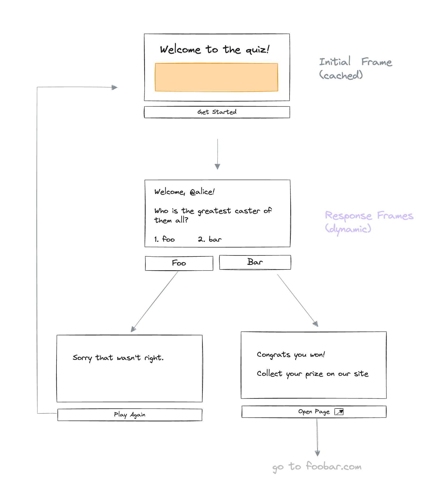

# Lens Protocol Frames

Frames are an extension of the OpenGraph standard that enables interactive elements to be embedded from one web application into another.

The Lens Frames specification follows the [Open Frames standard](https://github.com/open-frames/standard/tree/main) to enable Frame and client developers to support multiple Frame types in a single application.

The highlights of the Lens spec:

- Modification of `untrustedData` to reference Lens Protocol primitives
  - `profileID` and `pubID`
- Modification of `trustedData` to provide authentication based on Lens Protocol primitives
  - Signed data or identity token

Contents:

- [Lens Frame Specification](#lens-frame-specification)
  - [For Frame Servers](#for-frame-servers)
  - [For Client Applications](#for-client-applications)
  - [Lens Frame Request](#lens-frame-request)
  - [Lens Frame Authentication](#lens-frame-authentication)

# Lens Frame Specification

A frame is a set of <meta> tags returned within the <head> of an HTML page. If a page contains all required frame properties, apps will render the page as a frame. The frame <meta> tags extend the OpenGraph protocol.

A frame app begins with an initial frame which is cached by apps and shown to users. A frame must have an image. It may have buttons, which when clicked load other frames or redirect the user to external websites.

<p align="center">
  
</p>

# For Frame Servers

A Frame Server exposes HTML tags representing a Frame instance. The server handles requests from client applications and updates exposed HTML tags accordingly.

A frame must include required properties and may contain optional properties.

## Properties

A frame property is a meta tag with a property and a content value.

### Required Properties

In compliance with the Open Frames standard, use a meta tag in your frame's HTML to declare the client protocols your frame supports.

<meta property="of:accepts:lens" content="2024-03-01" />

| Property          | Description                                                                                                                      |
| ----------------- | -------------------------------------------------------------------------------------------------------------------------------- |
| `of:version`      | The version label of the Open Frames spec. Currently the only supported version is `vNext`                                       |
| `of:accepts:lens` | The minimum client protocol version accepted for the given protocol identifier. Currently the only supported version is `vNext`. |
| `of:image`        | An image which should have an aspect ratio of `1.91:1` or `1:1`.                                                                 |
| `og:image`        | An image which should have an aspect ratio of `1.91:1`. Fallback for clients that do not support frames.                         |

### Optional properties

| Property                | Description                                                                                                                                                                                                                                                                        |
| ----------------------- | ---------------------------------------------------------------------------------------------------------------------------------------------------------------------------------------------------------------------------------------------------------------------------------- | --- | --- |
| `of:button:$idx`        | 256 byte string containing the user-visible label for button at index `$idx`. Buttons are 1-indexed. Maximum 4 buttons per Frame. `$idx` values must be rendered in an unbroken sequence.                                                                                          |
| `of:button:$idx:action` | Valid options are `post`, `post_redirect`, `mint`, and `link`. Default: `post`                                                                                                                                                                                                     |
| `of:button:$idx:target` | The target of the action. For post , post_redirect, and link action types the target is expected to be a URL starting with `http://` or `https://`. For the mint action type the target must be a [CAIP-10 URL](https://github.com/ChainAgnostic/CAIPs/blob/main/CAIPs/caip-10.md) |
| `of:post_url`           | The URL where the POST payload will be sent. Must be valid and start with `http://` or `https://` . Maximum 256 bytes.                                                                                                                                                             |
| `of:input:text`         | If this property is present, a text field should be added to the Frame. The contents of this field will be shown to the user as a label on the text field. Maximum 32 bytes.                                                                                                       |
| `of:image:aspect_ratio` | The aspect ratio of the image specified in the `of:image` field. Allowed values are `1.91:1` and `1:1`. Default: `1.91:1`                                                                                                                                                          |
| `of:image:alt`          | Alt text associated with the image for accessibility                                                                                                                                                                                                                               |
| `of:state`              | A state serialized to a string (for example via JSON.stringify()). Maximum 4096 bytes. Will be ignored if included on the initial frame                                                                                                                                            |     |     |

### Images

There are a few rules for serving images in `of:frame:image` tags:

- The size of the image must be < 10 MB.
- The type of image must be jpg, png or gif.
- The image source must either be an external resource with content headers or a data URI.

Clients may resize larger images or crop those that do not fit in their aspect ratio. SVG images are not because they can contain scripts and extra work must be done by clients to sanitize them.

When a frame server receives a POST request:

- It must respond within 5 seconds.
- It must respond with a 200 OK and another frame, on a post button click.
- It must respond with a 302 OK and a Location header, on a post_redirect button click.
- Any Location header provided must contain a URL that starts with http:// or https://.

Best Practices:

- Add timestamps or UUIDs to image urls on subsequent frames to bust caches.
- Return a frame with a "refresh" button if your response takes > 5 seconds.
- Sanitize all input received from the user via text inputs.
- If needed, validate request data according to [Lens Frame Authentication](#lens-frame-authentication)

# For Client Applications

A Client Application is where Frames are rendered. A publication containing Frame tags has elements rendered based on the Frame specification and individual tags/values of the Frame instance.

When a user clicks a button on a frame, the app makes a POST request to the frame server. The server must respond with a new frame that is sent back to the user.

The Frame lifecycle begins when a user creates a publications containing a frame URL. The client application should:

- Check all embedded publication URLs for valid frames (based on meta tag versions).
- If the frame is valid, render the frame when the cast is viewed.
- If the frame is malformed, fall back to treating it as an OpenGraph embed.
- Follow the frame security model.
- Proxy image requests to prevent frame servers from tracking users.
- Sanitize redirect URLs to ensure they start with http:// or https://.
- Only accept data URIs if they are images.
- Avoid rendering SVGs as they may contain executable code.

### Rendering Frames

Apps may render frames any time they are showing a Lens Publication to a viewer. The following rules apply to the rendering of frames:

1. Buttons must be displayed in ascending index order below the image.
2. Buttons may be displayed in multiple rows if space is a constraint.
3. Text inputs must be displayed above the buttons and below the image.
4. Text input labels must be shown above or inside the text input.
5. Apps must respect the aspect ratio set in the `of:frame:image:aspect_ratio` property.

If the button is a `post_redirect` or `link` action:

1. It must be visually marked with a redirect symbol.
2. Users should be warned when leaving the app for untrusted sites.

If the button is a `mint` action, the following rules also apply:

1. Must validate that a [CAIP-10](https://github.com/ChainAgnostic/CAIPs/blob/main/CAIPs/caip-10.md) URL is present in the `target` property.
2. Must display the item as an NFT, if all the properties are valid.

### Handling Clicks

If the button clicked is a `post` or `post_redirect`, apps must:

1. Construct a [Lens Frame Request](#lens-frame-request).
2. POST the packet to `of:frame:button:$idx:target` if present
3. POST the packet to `of:frame:post_url` if target was not present.
4. POST the packet to or the frame's embed URL if neither target nor action were present.
5. Wait at least 5 seconds for a response from the frame server.

If the button clicked is a `mint`, apps should:

1. Allow the user to mint the NFT or open an external page that allows this functionality.

### Handling Responses

Applications will receive responses from frame servers after a POST request is submitted. The following rules apply to the handling of these responses:

1. If the button action was `post`, treat all non-200 responses as errors.
2. If the button action was `post_redirect`, treat all non-30X responses as errors.
3. If handling a 30X response, apps must redirect the user to the url location value.
4. If handling a 30X response, apps must ensure the url starts with `http://` or `https://`.
5. If handling a 30X response, warn the user before directing them to an untrusted site.

## Lens Frame Request

```
{
  clientProtocol: "lens",
  untrustedData: {
    profileId: "0x123",  // Lens profile ID
    pubId: "0x123-0x1", // Lens publication ID, profile ID + profile publication index
    url: "https://example.com"; // The URL of the Frame that was clicked.
    unixTimestamp: 123456789; // Unix timestamp in milliseconds
    buttonIndex: 1; // The button that was clicked
    inputText?: "hello world; // Input text for the Frame's text input, if present. Undefined if no text input field is present
    state?: ""; // State that was passed from the frame, passed back to the frame, serialized to a string. Max 4kB.q
  };
  trustedData: {
    messageBytes: "";
  };
};
```

## Lens Frame Authentication

Lens Frames have two variations of `trustedData`, identified by a prefix. The format for a Lens Frame server request is [detailed above](#lens-frame-request).

The `messageBytes` field of `trustedData` must follow one of two formats:
1.) `profile:$identityToken` - Where `$identityToken` is the Lens API identity token passed from client application to Frame server for the server to authenticate based on [these steps](#lens-api-identity-token)
2.) `request:$type:$address:$messageBytes` - Where

- `$type` is one of: `owner` (if signer is profile owner), `manager` (if signer is profile manager), or `dispatcher` (if signer is profile dispatcher)
- `$address` is the address of the signer from `$type`
- `$messageBytes` is the signed message from the Lens profile, profile manager, or dispatcher address according to the EIP-712 typed data [signed message request](#signed-message-request)

### Lens API Identity Token

TODO: keep GraphQL explanations but start by providing abstractions in Lens SDK

When authenticating with the Lens API, an `identityToken` will be returned which can be used to send with Frame requests to allow the Frame server to authenticate that a valid session exists for the corresponsing `profileId`. The `identityToken` is used in place of an `accessToken` so the Frame server only has read-only access to the verify the profile.

```
mutation Authenticate {
  authenticate(request: {
    id: "6e2ff9c2-3c9d-45c7-a990-7b7d23b989ba", # ChallengeId
    signature: "0x8f82e1a2c2cc35a2963c60eeb0a76aecc100686c4ffcb98fd522a90cba2f0b2642067c79cd6d0c9d239ed28a6882818f77bf546e774410236c730988bd14de5d1c"
  }) {
    accessToken
    refreshToken
    identityToken
  }
}
```

A Frame server can validate an identity token as valid using the `verify` endpoint:

```
query Query {
  verify(request: {
    identityToken: "eyJhbGmiOiJ...",
    for: "0x01,
  })
}
```

### Signed Message Request

TODO: keep TypedData + GraphQL explanations but start by providing abstractions in Lens SDK

For additional verification on the Frame server, a signed message can be used to authenticate the contents of a Frame request. A message can signed from the profile owner, or an approved profile manager / dispatcher address.

If a user has approved the Lens API as a dispatcher address, then Frame messages can be signed without requiring a manual signature by using the Lens API `frameDispatcherSignature` endpoint:

```
mutation FrameSignature {
  frameDispatcherSignature(request: {
    specVersion: "1.0.0"                                                   // string, version of Lens Frames spec
    url: "https://mylensframe.xyz"                                         // string, The URL of the frame app
    buttonIndex: 2                                                         // number, The index of the button that was clicked
    profileId: "0x2a6b",                                                   // string, profile interacting with the frame
    pubId: "0x2a6b-0x11-DA-bf2507ac"                                       // string, the publication which contained the frame URĽ
    inputText: "Hello, World!"                                             // string, The text from the user input (if any)
    state: "{\"counter\":1,\"idempotency_key\":\"431b8b38-eb4d-455b\"}"    // string, bytes value sent by frame server
  }) {
    signedMessage
  }
}
```

The signed message correspons to EIP-712 typed data that can be validated using the following signature scheme:

```
// EIP-712 domain
const domain = {
    name: 'Lens Frames',
    version: '1.0.0',
}

// EIP-712 types
const types = {
    FrameData: [
        { name: 'specVersion', type: 'string' },
        { name: 'url', type: 'string' },
        { name: 'buttonIndex', type: 'uint256' },
        { name: 'profileId', type: 'string' },
        { name: 'pubId', type: 'string' },
        { name: 'inputText', type: 'string' },
        { name: 'state', type: 'string' },
    ],
};

// Data to sign, from frameDispatcherSignature endpoint request
const sampleData = {
    specVersion: '1.0.0',
    url: 'https://mylensframe.xyz',
    buttonIndex: 2,
    profileId: '0x2a6b',
    pubId: '0x2a6b-0x11-DA-bf2507ac',
    inputText: 'Hello, World!',
    state: '{"counter":1,"idempotency_key":"431b8b38-eb4d-455b"}',
};
```
